# dorm
## 高校宿舍管理系统-毕设
## 技术栈 
### 前后端分离，SpringBoot+MyBatis+Vue.js
### 数据库：MySQL
### 关键字：宿舍管理；数据可视化；管理系统

## 项目功能列表 
左侧是学生用户前台功能，右侧为管理后台功能
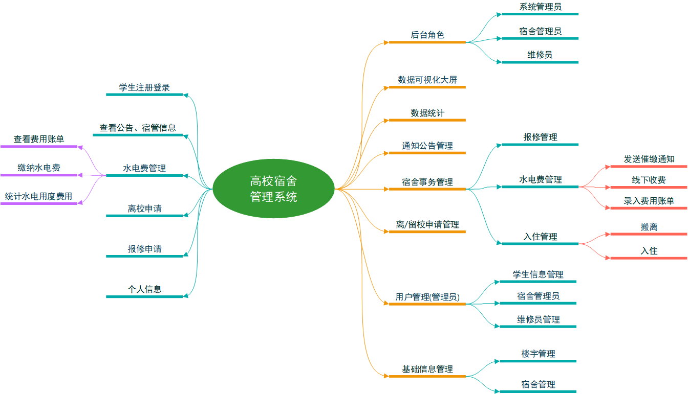

### 更多项目 
本博主还有掌上智慧农场小程序、基于决策树算法的农作物病虫害智能诊断平台、校园二手平台小程序、高校宿舍管理系统、流浪宠物救助平台、网上商城、公寓租赁平台等众多原创一手项目，适合初学者实践入门、毕业设计等。有需要请邮件联系：157086662@qq.com

## 运行截图 
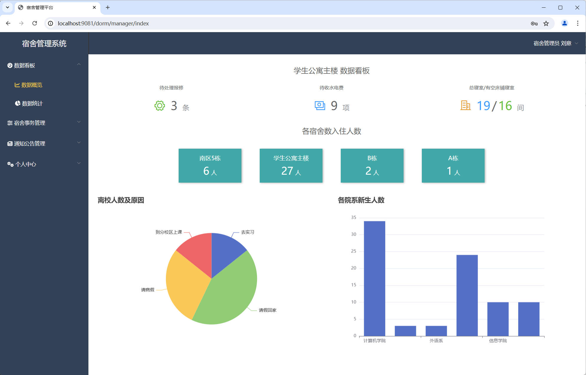

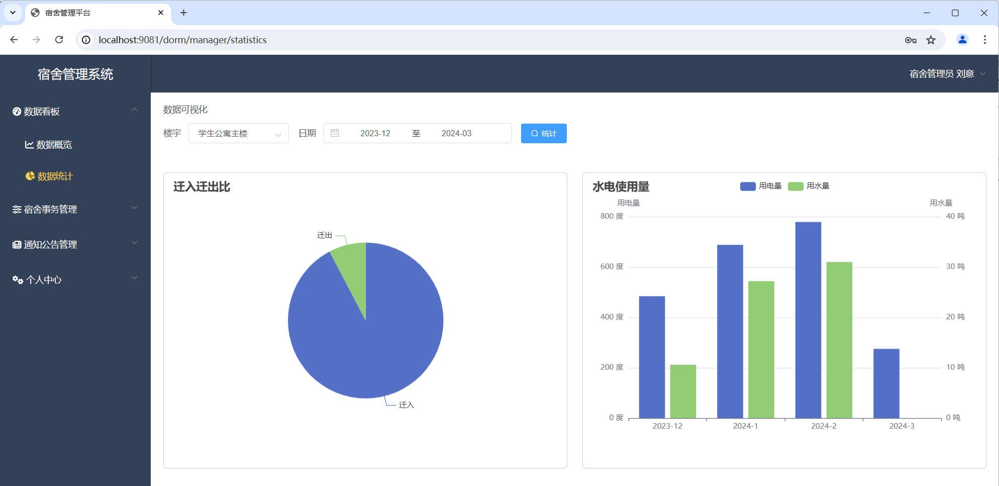

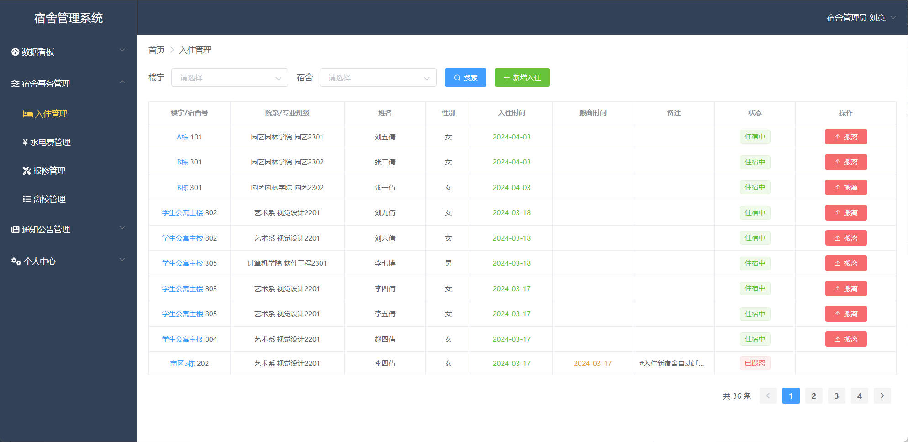

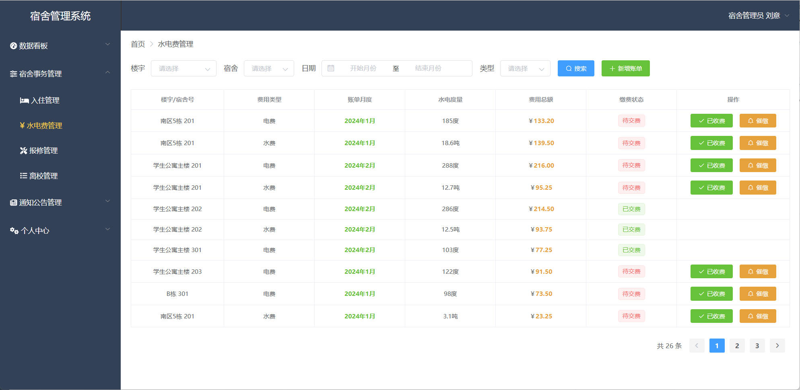

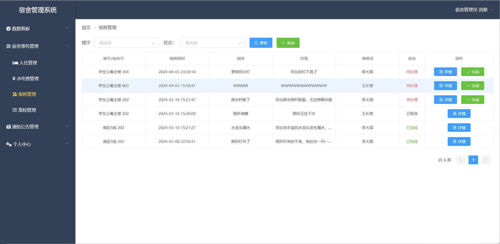

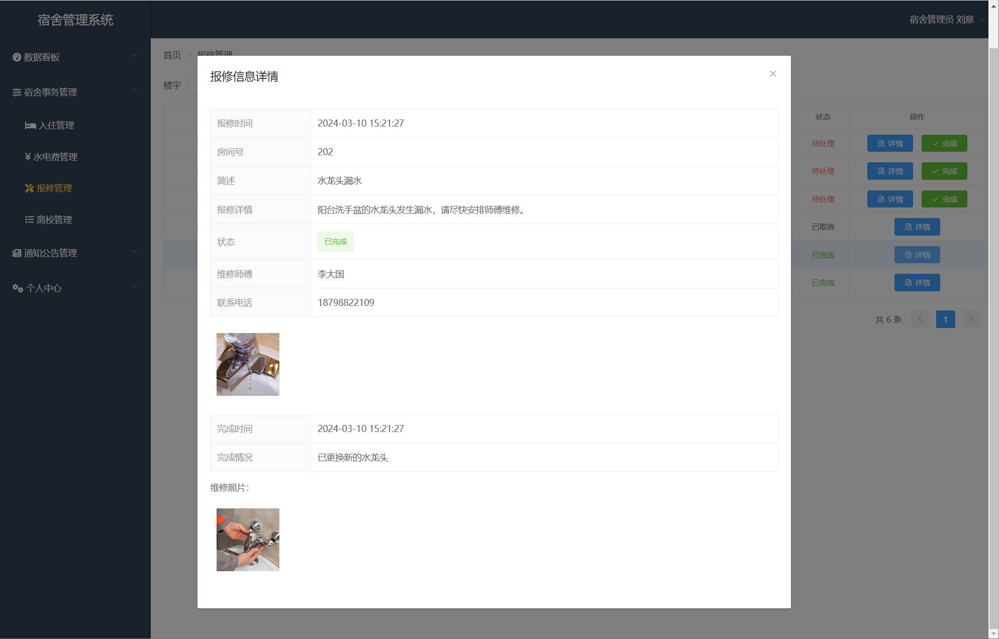

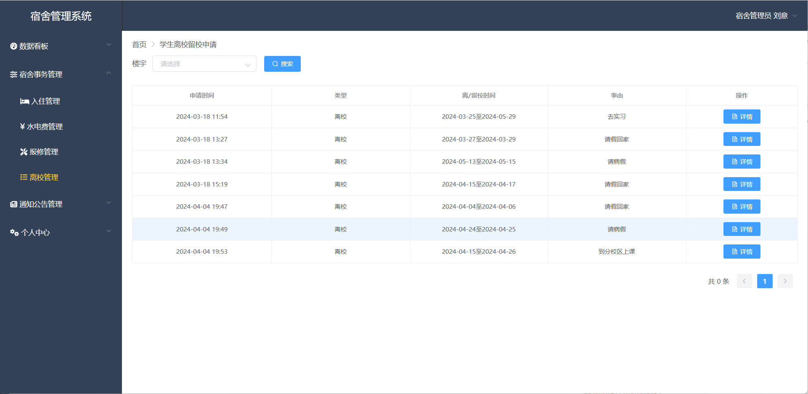

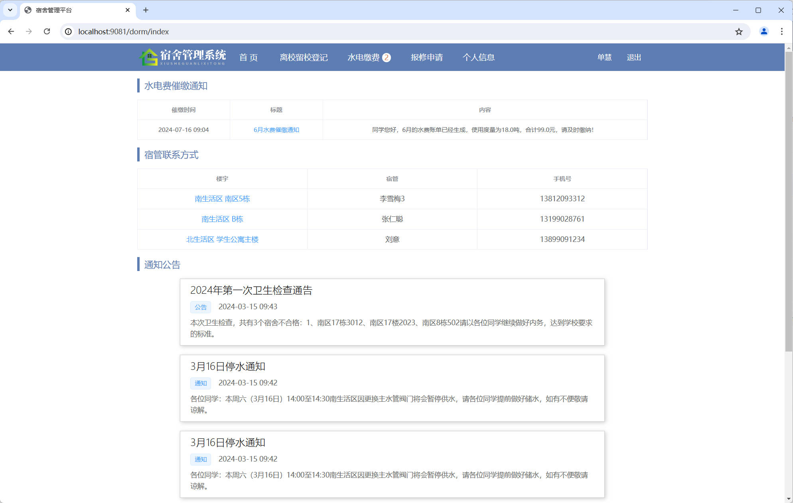

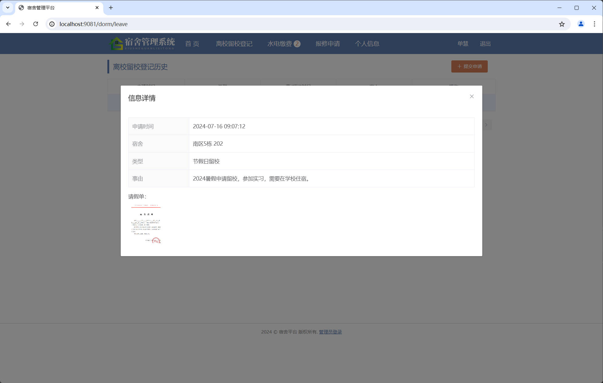

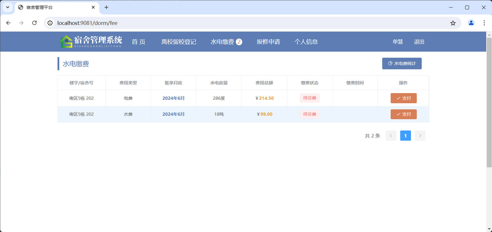

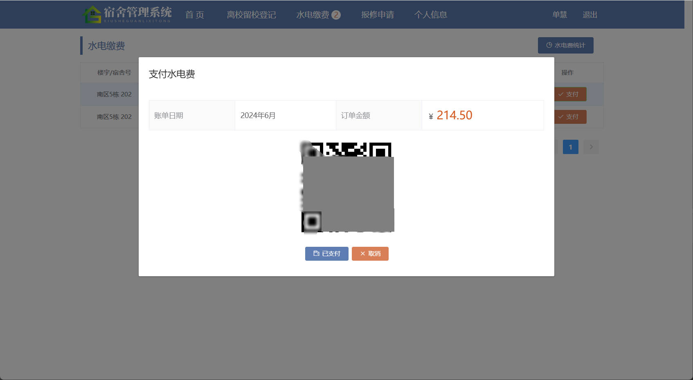

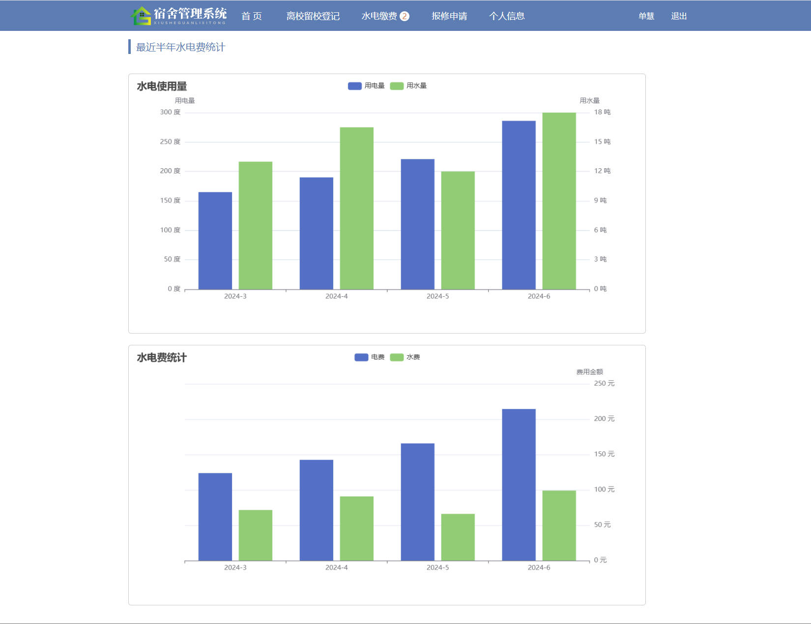

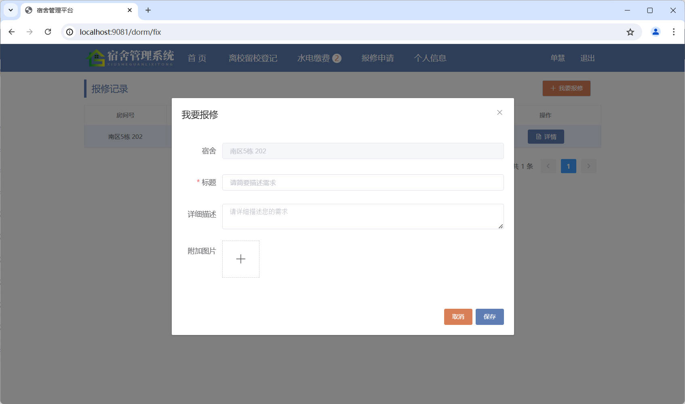

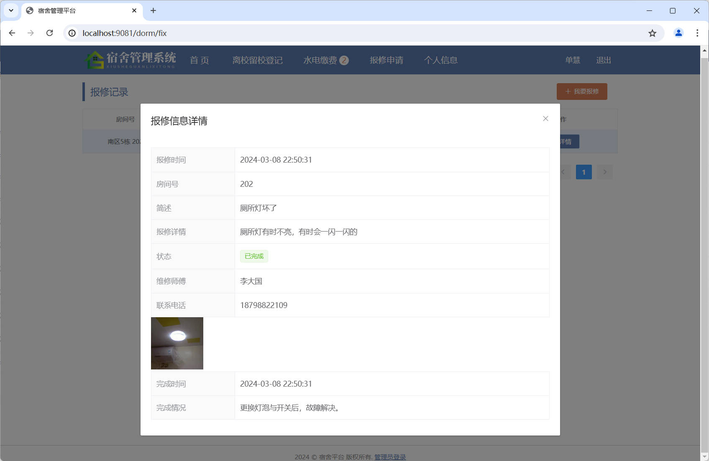
